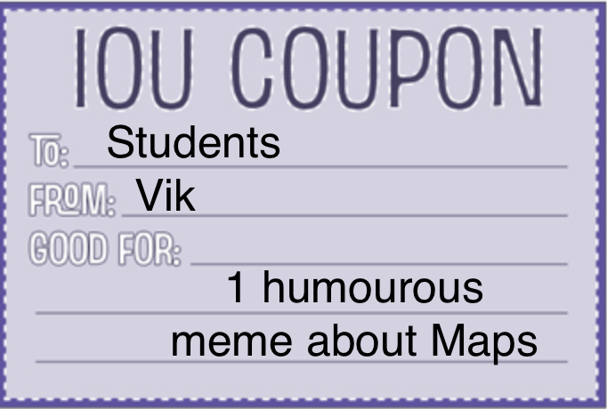

# Exercise 9.1 - 🗺️ Maps

## 🎯 Objectives

- **Implement** a map data structure in Java.

## 🔨 Setup

1. Clone the repo (or download the zip) for this exercise, which you can find [here](https://github.com/JAC-CS-Programming-4-W23/E9.1-Maps).
2. Start IntelliJ, go to `File -> Open...`, and select the cloned/downloaded folder.
3. If at the top it says "Project JDK is not defined", click "Setup JDK" on the top right, and select the JDK version you have installed on your machine.

   

4. To get the unit tests to work, open `TestMaps.java` and add JUnit to the classpath:

   

   - Just click "OK" on the resulting dialogue window and all the test-related red squigglies should disappear.

## 🔍 Context

See [notes](https://jac-cs-programming-4-w23.github.io/Notes/#/9-Maps) about Maps!

## 🚦 Let's Go

## Phone Mnemonics

Convert a phone number "mnemonic" into the digit sequence represented by the mnemonic.

1. Create a map from the parallel arrays.
2. Convert the mnemonic, ignoring non-alphabetical characters.

## Word Counting

Count the occurrences of each word in a document. This information can be useful in find document is about, for example in searching

The count should not include "stop words". These are common words, like "the" and "of", that don't provide additional information about the document.

When processing the document, to uses whitespace and remove punctuation, use the delimiter `[\p{Punct}\s]+`.

## Set Intersection

Use a map to compute the _intersection_ (all common elements) of a collection of sets. For example, the sets:

```text
{
    { a, b, c },
    { b, c, d },
    { c, a, d },
}
```

have the intersection `{ c }`.

## 🔬 Observations

- Have you used maps before? If so, in what contexts?
- What other contexts can you think of where a Map would be useful?

---


